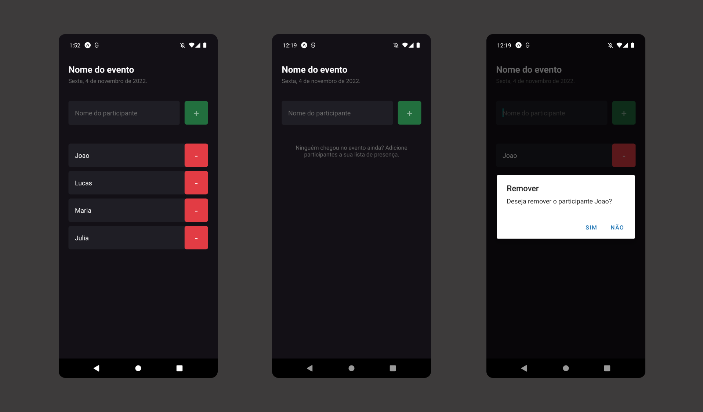

<h1 align="center"> imhere </h1>

  <a href="#-tecnologias">Tecnologias</a>&nbsp;&nbsp;&nbsp;|&nbsp;&nbsp;&nbsp;
  <a href="#-projeto">Projeto</a>&nbsp;&nbsp;&nbsp;|&nbsp;&nbsp;&nbsp;
  <a href="#memo-licença">Licença</a>

  

 

  

## 🚀 Tecnologias

Esse projeto foi desenvolvido com as seguintes tecnologias:

- React Native
- TypeScript
- Expo

## 🔥 Algumas features neste projeto

- React Hooks
- Tipagem com Typescript
- Componentização no React Native

## ✨ Neste projeto você pode ver

- Formulário para adicionar novos participantes ao evento.
- Ao adicionar, uma listagem de participantes com um botão para excluir o participante selecionado.
- Ao clicar para excluir, é aberto uma janela para confirmação de exclusão.
- Ao tentar cadastrar um participante já cadastrado é mostrado um aviso, alertando que este participante já está incluso no evento.

## 💻 Projeto

- Está é uma aplicação simples para adicionar e listar participantes de um evento criada com React Native e Expo.

## ✅ Esse projeto foi criado ao longo do curso Ignite React Native da plataforma Rocketseat

## 📝 Licença

Esse projeto está sob a licença MIT.

---
